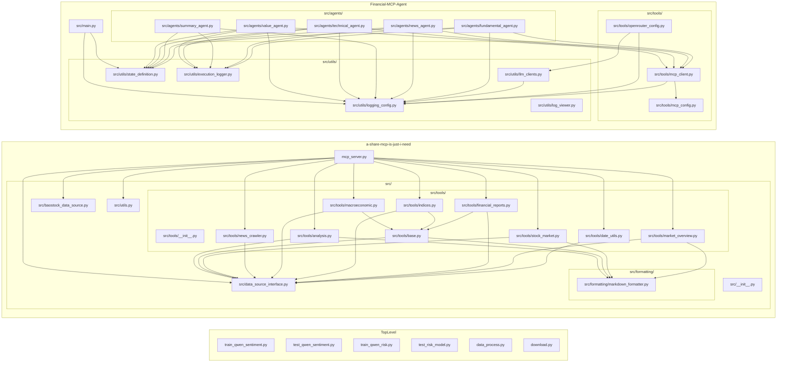

## 模块与依赖总览（Finance）

本文件汇总项目内各个 `.py` 文件的项目功能与主要职责，并给出以“文件为单位”的内部依赖关系图（Mermaid）。第三方库不在关系图中呈现。

### 依赖关系图（按文件粒度）

---

## 各文件功能与主要职责

### 顶层（Finance 根目录）
- download.py
  - 作用：下载 Hugging Face 模型 `Qwen/Qwen3-8B` 到本地 `./Qwen`，支持断点续传与下载统计。
  - 主要函数：
    - download_qwen3(): 执行 snapshot_download，记录耗时、文件数量与大小并打印摘要。

- data_process.py
  - 作用：新闻数据去重流水线，综合编辑距离+TFIDF 余弦相似、MinHash（Jaccard 估计）、SimHash（汉明距离）三重判定，产出去重后的 JSONL。
  - 主要类：
    - NewsDeduplicator
      - unicode_normalize(): 文本标准化。
      - edit_distance(): 归一化编辑距离。
      - text_to_tfidf_vector(): TF-IDF 向量。
      - title_similarity(): 标题相似度（编辑距离+余弦相似度均值）。
      - get_shingles()/minhash_signature()/jaccard_similarity_minhash(): MinHash 管线，估计正文重合度。
      - simhash()/hamming_distance()/semantic_similarity(): SimHash 与语义“距离”估计。
      - content_overlap(): 使用 MinHash 估计正文相似。
      - is_duplicate(): 三重阈值综合判重。
      - load_and_preprocess_data(): 读取 CSV 并转内部统一结构。
      - deduplicate(): 主循环去重。
      - save_to_jsonl(): 输出 JSONL。
      - process_dataset(): 一键处理（读入→去重→落盘）。

- train_qwen_sentiment.py
  - 作用：基于本地 Qwen 基座，用 LoRA 训练“情感打分（1-5）”自回归模型。
  - 主要函数：
    - load_and_preprocess_data(): 读取 CSV，过滤缺失/无效标签，打印分布。
    - create_prompt_template(): 构建对话式 few-shot prompt。
    - prepare_dataset(): 构建 Dataset，切分并 tokenize；labels = input_ids。
    - create_model_and_tokenizer(): 加载基座与分词器、k-bit 训练适配、配置 LoRA。
    - train_model(): 配置 `TrainingArguments`、`Trainer` 训练与保存。
    - main(): 串联全流程。

- test_qwen_sentiment.py
  - 作用：加载 LoRA 情感模型推理，解析分数字符，含真实小样评测与类别分布测试。
  - 主要函数：
    - load_trained_sentiment_model(): 基座+PEFT 权重装配模型与 tokenizer。
    - create_sentiment_test_prompt(): 生成测试 prompt。
    - predict_sentiment(): `generate` 推理并解析 “Assistant:” 后的数字。
    - test_sentiment_model(): 手工用例与 CSV 小样评估。
    - test_sentiment_distribution(): 类别 1-5 的准确性统计。

- train_qwen_risk.py
  - 作用：基于本地 Qwen 基座，用 LoRA 训练“风险打分（1-5）”自回归模型。
  - 主要函数：与情感训练同结构
    - load_and_preprocess_data(), create_prompt_template(), prepare_dataset(), create_model_and_tokenizer(), train_model(), main()。

- test_risk_model.py
  - 作用：加载 LoRA 风险模型推理，解析风险分数字符，含手工用例与真实小样评测。
  - 主要函数：
    - load_trained_risk_model(), create_risk_test_prompt(), predict_risk(), test_risk_model()。

### 目录 nasdaq_news_sentiment
- 1.ipynb：情感数据探索/清洗笔记本。
- 1.csv：情感小样数据。

### 目录 risk_nasdaq
- 2.ipynb：风险数据探索/清洗笔记本。
- 2.csv：风险小样数据。

### 子项目 a-share-mcp-is-just-i-need
- mcp_server.py
  - 作用：启动 FastMCP 服务器，注册各类工具，装配 A 股数据源与日志。
  - 主要职责：初始化服务器；注册 tools（stock_market、financial_reports、indices、market_overview、macroeconomic、date_utils、analysis、news_crawler）；注入 `FinancialDataSource` 实现（如 `BaostockDataSource`）。

- test_baostock.py
  - 作用：Baostock 数据源的简单连通/功能测试（推断）。

- src/__init__.py：包初始化。

- src/baostock_data_source.py
  - 作用：基于 baostock 的金融数据源实现。
  - 主要职责：实现 `FinancialDataSource` 接口，提供行情、财务、指数、宏观等具体拉取。

- src/data_source_interface.py
  - 作用：定义金融数据源抽象接口与通用异常。
  - 主要类：`FinancialDataSource(ABC)`、`NoDataFoundError`、`LoginError`、`DataSourceError`。

- src/utils.py
  - 作用：通用工具。
  - 主要函数：`setup_logging()`：统一日志初始化与格式配置。

- src/formatting/__init__.py：包初始化。

- src/formatting/markdown_formatter.py
  - 作用：结果格式化。
  - 主要函数：`format_df_to_markdown()`：将 DataFrame/数据对象转 Markdown。

- src/tools/__init__.py：包初始化。

- src/tools/base.py
  - 作用：工具层基础封装与统一处理。
  - 主要职责：通用调用封装、异常映射、markdown 格式化适配；提供 `call_macro_data_tool`、`call_index_constituent_tool`、`call_financial_data_tool` 等（被其他工具模块复用）。

- src/tools/analysis.py
  - 作用：分析类工具注册与实现。
  - 主要职责：`register_analysis_tools(FastMCP, FinancialDataSource)`：注册分析相关工具；内部调用数据源与 Markdown 格式化。

- src/tools/financial_reports.py
  - 作用：财报相关工具。
  - 主要职责：`register_financial_report_tools(FastMCP, FinancialDataSource)`：注册财报查询工具；复用 base 调用。

- src/tools/indices.py
  - 作用：指数相关工具。
  - 主要职责：`register_index_tools(FastMCP, FinancialDataSource)`：注册指数与成分查询工具；复用 base 调用。

- src/tools/macroeconomic.py
  - 作用：宏观经济指标工具。
  - 主要职责：`register_macroeconomic_tools(FastMCP, FinancialDataSource)`：注册宏观指标工具；调用 base 中封装。

- src/tools/market_overview.py
  - 作用：市场概览工具。
  - 主要职责：`register_market_overview_tools(FastMCP, FinancialDataSource)`：注册概览/盘面类工具；支持 markdown 格式化。

- src/tools/date_utils.py
  - 作用：日期/交易日工具。
  - 主要职责：`register_date_utils_tools(FastMCP, FinancialDataSource)`：注册交易日/自然日相关工具。

- src/tools/news_crawler.py
  - 作用：新闻抓取类工具。
  - 主要职责：`register_news_crawler_tools(FastMCP, FinancialDataSource)`：注册新闻爬取/检索工具；通过接口获得数据。

- src/tools/stock_market.py
  - 作用：股票市场类工具。
  - 主要职责：`register_stock_market_tools(FastMCP, FinancialDataSource)`：注册个股行情与指标工具；markdown 展示。

### 子项目 Financial-MCP-Agent
- src/__init__.py：包初始化。

- src/main.py
  - 作用：多 Agent 主入口，调度执行与报告生成。
  - 主要职责：程序启动、环境与日志初始化；构建/运行 Agents（fundamental/news/technical/value/summary）； orchestrate 工具与 LLM；落盘报告与执行日志。

- src/agents/fundamental_agent.py
  - 作用：基本面分析 Agent。
  - 主要职责：使用 MCP 工具与 LLM 生成基本面结论；写入执行日志。

- src/agents/news_agent.py
  - 作用：新闻与情绪侧 Agent。
  - 主要职责：汇总新闻、调用 MCP 工具、归纳影响与结论。

- src/agents/summary_agent.py
  - 作用：汇总 Agent。
  - 主要职责：整合各 Agent 输出，生成面向用户的总结/报告。

- src/agents/technical_agent.py
  - 作用：技术面分析 Agent。
  - 主要职责：结合指标/图形思路、MCP 市场工具与 LLM，总结技术面观点。

- src/agents/value_agent.py
  - 作用：估值/性价比 Agent。
  - 主要职责：关注估值水平、比较与结论产出。

- src/tools/mcp_client.py
  - 作用：MCP 客户端。
  - 主要职责：`get_mcp_tools()` 连接多服务器，聚合 MCP 工具列表/句柄供 Agents 调用。

- src/tools/mcp_config.py
  - 作用：MCP 服务器配置。
  - 主要内容：`SERVER_CONFIGS`：端点、鉴权与路由配置。

- src/tools/openrouter_config.py
  - 作用：OpenRouter/Google/OpenAI 等 LLM 接入与重试策略。
  - 主要职责：配置读取（dotenv）、退避重试（backoff）、封装 LLM 客户端工厂或适配器。

- src/utils/logging_config.py
  - 作用：统一日志设施。
  - 主要函数/常量：`setup_logger()`；`SUCCESS_ICON`/`ERROR_ICON`/`WAIT_ICON`。

- src/utils/state_definition.py
  - 作用：Agent 状态/消息结构定义。
  - 主要类型：`AgentState(TypedDict)` 等，用于管道共享的上下文/消息结构。

- src/utils/execution_logger.py
  - 作用：执行过程落盘记录。
  - 主要函数：`get_execution_logger()`：构建“本次执行”的结构化记录器（写入 logs）。

- src/utils/llm_clients.py
  - 作用：多厂商 LLM 客户端抽象。
  - 主要内容：`LLMClientFactory` 按配置创建 OpenAI/Google 等客户端，带 backoff 重试；依赖 `logging_config`。

- src/utils/log_viewer.py
  - 作用：日志查看与筛选的 CLI 工具。
  - 主要职责：解析 logs 目录结构，按时间/Agent/阶段过滤显示。

---

### 使用建议
- 路径参数：训练/测试脚本默认使用硬编码路径（如 `/root/code/Finance/Qwen`），建议统一改为相对路径（如 `./Qwen`、`./qwen_sentiment_model`、`./qwen_risk_model`）。
- 运行顺序：先 `download.py` 获取基座 →（可选）`data_process.py` 去重 → 训练脚本 → 测试脚本。

